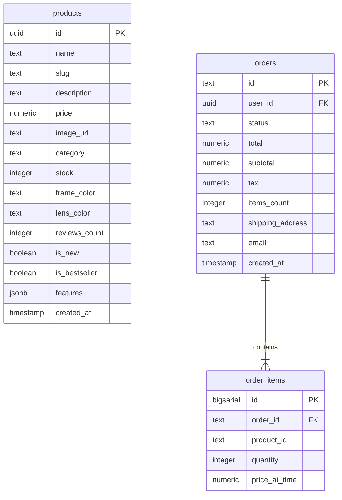

# ShadeVault — Premium Sunglasses E-Commerce Store

[](https://nextjs.org/)
[](https://react.dev/)
[](https://www.typescriptlang.org/)
[](https://tailwindcss.com/)
[](https://supabase.com/)
[](https://www.mailgun.com/)

**ShadeVault** is a modern, responsive, full-stack e-commerce web application built for the **HNG 15 Lesson 2** individual shop/e-commerce submission. The application features a curated catalogue of luxury sunglasses, full shopping cart management, server-validated checkout, persistent order recording in Supabase PostgreSQL, Google OAuth authentication, authenticated order history, and automated transactional order confirmation emails via Mailgun.

---

## 1. Project Overview

ShadeVault delivers a high-end online shopping experience for luxury eyewear. Designed with a dark glassmorphism aesthetic and responsive UI layout, ShadeVault ensures security and data integrity by enforcing server-side price and stock validation during checkout, keeping sensitive API keys off the client, and protecting user privacy using Supabase Row Level Security (RLS).

---

## 2. Features

* **Product Catalogue:** Browse curated premium sunglasses with dynamic filtering by category, search keywords, and price sorting.
* **Product Detail Pages:** Individual product views featuring high-resolution images, detailed frame/lens specifications, stock availability, and user reviews.
* **Cart Management:** Interactive client cart context with real-time quantity controls, line-item pricing, subtotal calculations, and browser persistence.
* **Server-Validated Checkout:** Checkout processing implemented as a Next.js Server Action (`createOrderServerAction`). Product prices, subtotal, tax, and inventory stock are calculated and validated strictly on the server—client-supplied prices are never trusted.
* **Supabase Database Persistence:** Orders and line items are written directly to Supabase PostgreSQL database tables (`public.orders` and `public.order_items`).
* **Google Authentication:** Seamless single sign-on (SSO) using Google OAuth integrated through Supabase Auth.
* **Authenticated Order History:** Protected user order dashboard displaying real-time and historical orders linked to the logged-in user's account.
* **Cross-Session Order Persistence:** Customer order records remain available across logout, browser restart, and subsequent sign-in.
* **Mailgun Confirmation Emails:** Automatic dispatch of HTML and plain-text order confirmation receipts via server-side Mailgun API integration.
* **Polished Responsive Design:** Styled with Tailwind CSS v4 featuring micro-interactions, dark mode elegance, dynamic status badges, and mobile drawer menus.

---

## 3. HNG 15 Lesson 2 Requirements & Implementation

| Requirement | ShadeVault Implementation | Status |
| :--- | :--- | :--- |
| **Functional E-Commerce Shop** | Complete online store for luxury sunglasses with home, catalog, detail, cart, checkout, login, and order history pages. | **Completed** |
| **Product Experience** | Dynamic product catalog with category filter, search input, price sorting, and individual detail pages (`/products/[id]`). | **Completed** |
| **Add-to-Cart** | Client-side React Context (`CartContext`) supporting adding items, updating quantities, item removal, and persistent state. | **Completed** |
| **Checkout Flow** | Server Action-backed checkout collecting delivery details and executing server-side order calculation and storage. | **Completed** |
| **Persistent Database** | Supabase PostgreSQL tables storing product catalog, customer orders, and order items. | **Completed** |
| **Mailgun Confirmation Email** | Server-side transactional email service dispatching HTML receipt emails to customer inbox upon successful checkout. | **Completed** |
| **Google Authentication** | OAuth 2.0 single sign-on powered by Supabase Auth and Google Cloud Console credentials. | **Completed** |
| **Persistent Order History** | User-specific order dashboard (`/orders`) retrieving persisted orders directly from Supabase for authenticated users. | **Completed** |
| **Git / GitHub Repository** | Source code maintained under version control and hosted on GitHub. | **Completed** |
| **Production Deployment** | Deployment target prepared for Vercel with server environment variable configuration. | **Pending** |

---

## 4. Technology Stack

| Technology | Role & Purpose |
| :--- | :--- |
| **Next.js 16.3.8 (App Router)** | Full-stack React framework enabling Server Components, Server Actions, API route handlers, and static build optimizations. |
| **React 19** | Modern UI rendering library utilizing Server Components and client hooks. |
| **TypeScript 5** | End-to-end static typing for catalog models, cart payloads, database schemas, and service interfaces. |
| **Tailwind CSS v4** | Utility-first CSS framework providing responsive layouts, glassmorphism design tokens, and smooth UI transitions. |
| **Supabase PostgreSQL** | Cloud database storing authoritative products, customer orders, and line items under strict Row Level Security. |
| **Supabase Auth** | Authentication backend handling session cookies, middleware refresh, and OAuth integrations. |
| **Google OAuth** | Identity provider allowing customers to sign in using their Google account credentials. |
| **Mailgun API** | Server-side transactional email delivery service used to dispatch instant purchase confirmation emails. |
| **Vercel** | Intended cloud deployment platform for production hosting, SSL, and serverless function execution. |
| **Git & GitHub** | Distributed version control system and repository hosting. |

---

## 5. Application Architecture & Directory Structure

```
shadevault/
├── src/
│   ├── app/                    # Next.js App Router routes & layouts
│   │   ├── auth/callback/      # OAuth exchange callback route handler
│   │   ├── cart/               # Cart page component
│   │   ├── checkout/           # Checkout form & client container
│   │   ├── login/              # Authentication page with Google OAuth button
│   │   ├── orders/             # Protected order history page
│   │   ├── products/           # Catalog listing & [id] detail page
│   │   ├── globals.css         # Tailwind v4 globals & custom styling
│   │   ├── layout.tsx          # Root layout with Header, Footer, & CartProvider
│   │   └── page.tsx            # E-commerce homepage
│   ├── components/             # Reusable UI component modules
│   │   ├── cart/               # Cart view components
│   │   ├── checkout/           # Order summary & shipping form UI
│   │   ├── layout/             # Header, Footer, Navigation
│   │   ├── products/           # Product card, filter, & detail view components
│   │   └── ui/                 # Reusable atomic UI elements (buttons, badges)
│   ├── context/                # Client state management
│   │   └── CartContext.tsx     # React Context for cart state & localStorage sync
│   ├── data/                   # Fallback data sources
│   │   └── mockProducts.ts     # Initial seed dataset & offline fallback catalog
│   ├── services/               # Server-side domain business logic
│   │   ├── emailService.ts     # Mailgun transactional email dispatch
│   │   ├── orderService.ts     # Order creation Server Action & order queries
│   │   └── productService.ts   # Product queries & catalog normalizers
│   ├── types/                  # TypeScript interface definitions
│   │   └── product.ts          # Product, CartItem, Order, & Payload types
│   └── utils/
│       └── supabase/           # Supabase SDK initializers
│           ├── client.ts       # Browser client for client components
│           ├── middleware.ts   # Session refresh middleware
│           └── server.ts       # Server client using Next.js cookies
├── public/                     # Static public assets (images, icons)
├── AGENTS.md                   # Repository guidelines & architectural principles
├── next.config.ts              # Next.js configuration settings
├── package.json                # Node.js dependencies & scripts
├── tsconfig.json               # TypeScript configuration
└── README.md                   # Project documentation
```

### Major Service Responsibilities

* **`productService.ts`:** Handles server-side product retrieval from Supabase `public.products`. Normalizes database snake_case fields, handles legacy ID/slug resolution, and provides safe fallback handling.
* **`orderService.ts`:** Implements `createOrderServerAction`, the secure entry point for processing purchases. Executes authenticated user checks, recalculates item prices and tax on the server, inserts records into `orders` and `order_items`, and triggers email dispatch. Also exposes `getAuthenticatedUserOrders()` for order history.
* **`emailService.ts`:** Encapsulates the Mailgun REST API call inside a server-only execution block (`'use server'`). Formats HTML tables and plain text receipt summaries, preventing Mailgun API keys from ever leaking to the browser.

---

## 6. Routes & Pages

| Route | Type | Description |
| :--- | :--- | :--- |
| `/` | Dynamic | Homepage featuring hero banners, value propositions, category highlights, and featured sunglasses. |
| `/products` | Dynamic | Complete sunglasses catalog with category filtering, keyword search, price sorting, and responsive product grids. |
| `/products/[id]` | Dynamic | Individual product detail page displaying high-res imagery, technical specs, stock indicators, and add-to-cart controls. |
| `/cart` | Static | Interactive shopping cart summary allowing quantity modifications, line-item removal, subtotal preview, and checkout navigation. |
| `/checkout` | Static | Secure checkout form capturing customer delivery details and submitting the order payload to the server action. |
| `/login` | Static | Authentication page providing one-click Google OAuth sign-in via Supabase Auth. |
| `/orders` | Dynamic | Protected customer dashboard rendering past and current orders retrieved from Supabase PostgreSQL for the logged-in user. |
| `/auth/callback` | Server Handler | OAuth callback route exchanging Google authorization codes for Supabase session cookies and redirecting back to the app. |
| `/_not-found` | Static | Custom 404 page for unmapped routes with navigation links back to the store catalog. |

---

## 7. Database Architecture & Schema

ShadeVault relies on Supabase PostgreSQL for data persistence across three core tables in the `public` schema.



### Table Details

1. **`public.products`:** Stores sunglasses catalog information including pricing, stock, category tags, visual properties, and search slugs.
2. **`public.orders`:** Stores high-level purchase transactions including server-calculated totals, customer delivery address, contact email, order status (`Processing`, `Shipped`, etc.), and owner `user_id`.
3. **`public.order_items`:** Line-item junction table storing individual products attached to an order, including snapshot prices (`price_at_time`) at purchase moment.

### Security Policies (RLS)

* **`products` Table:** Row Level Security is enabled. A `SELECT` policy grants public read access to all users (`anon` and `authenticated`).
* **`orders` and `order_items` Tables:** Row Level Security is enabled. Policies restrict `SELECT` queries to matching authenticated user sessions (`auth.uid() = user_id`), ensuring customers can only inspect their own purchase history.

---

## 8. Authentication Flow

ShadeVault uses Google OAuth 2.0 managed through Supabase Auth.

```
+----------+      1. Click Login       +------------+      2. Redirect       +---------------+
| Customer | ------------------------> | ShadeVault | ---------------------> | Supabase Auth |
+----------+                           +------------+                        +---------------+
     ^                                                                               |
     |                                                                               | 3. OAuth Grant
     |                                                                               v
+----------+                        5. Session Cookies                      +---------------+
| /orders  | <------------------------------------------------------------- | Google OAuth  |
+----------+                           Set via                              +---------------+
                                  /auth/callback
```

1. **Initiation:** User clicks "Sign in with Google" on the `/login` page.
2. **OAuth Request:** Client calls `supabase.auth.signInWithOAuth({ provider: 'google', redirectTo: '/auth/callback' })`.
3. **Google Consent:** User authenticates on Google's consent screen.
4. **Callback Processing:** Google redirects back to `/auth/callback`, where the server route handler exchanges the authorization code for a session token using `@supabase/ssr`.
5. **Session Persistence:** Next.js sets HTTP-only cookies, maintaining the user session across page refreshes and browser restarts.

---

## 9. Checkout & Server-Side Order Processing

To prevent tampering with item prices or order totals in client-side JavaScript, ShadeVault processes checkouts using a Next.js Server Action (`createOrderServerAction` in `src/services/orderService.ts`).

### Processing Pipeline

```
[Client Cart Payload] ──> [createOrderServerAction] ──> 1. Verify User Session
                                                     ──> 2. Fetch DB Product Prices & Stock
                                                     ──> 3. Calculate Subtotal, Tax (8%), & Total
                                                     ──> 4. Insert into public.orders
                                                     ──> 5. Insert into public.order_items
                                                     ──> 6. Trigger Mailgun Confirmation Email
                                                     ──> 7. Return Result & Redirect to /orders
```

1. **Payload Submission:** Client posts cart item IDs, quantities, and delivery address.
2. **Session Verification:** Server reads authenticated user context from HTTP cookies.
3. **Authoritative Price Lookup:** For each line item, the server fetches the actual product pricing directly from Supabase.
4. **Server Total Calculation:** Subtotal, tax (8%), and final total are computed mathematically on the server.
5. **Database Transaction:** An order ID (`ORD-2026-XXXX`) is generated and written to `public.orders`, followed by line items in `public.order_items`.
6. **Email Dispatch:** Mailgun delivers a branded confirmation email to the customer's email address.
7. **Client Response:** The browser receives confirmation and redirects the user to `/orders?success=true`.

---

## 10. Mailgun Transactional Email

When an order is created, `emailService.ts` sends a transactional receipt through Mailgun's REST API.

### Email Content

* **Order Header:** Order ID (`ORD-2026-XXXX`) and timestamp.
* **Customer Information:** Recipient email address and complete delivery shipping address.
* **Itemized Table:** Product name, ordered quantity, unit price, and total line-item price.
* **Financial Breakdown:** Calculated subtotal, sales tax, and final grand total.
* **Branding:** ShadeVault styled HTML header, dark mode layout, and plain-text fallback version.

*Note: Credentials (`MAILGUN_API_KEY`, `MAILGUN_DOMAIN`) are kept strictly environment-based on the server and are never exposed to client bundles.*

---

## 11. Environment Variables Configuration

Create `.env.local` in the project root for local development.

```env
# Public Supabase Credentials (Exposed to Browser)
NEXT_PUBLIC_SUPABASE_URL=https://your-supabase-project.supabase.co
NEXT_PUBLIC_SUPABASE_PUBLISHABLE_KEY=your-supabase-publishable-key

# Private Mailgun Credentials (STRICTLY SERVER-ONLY - Do NOT add NEXT_PUBLIC_)
MAILGUN_API_KEY=your-mailgun-api-key
MAILGUN_DOMAIN=your-mailgun-domain
MAILGUN_FROM_EMAIL="ShadeVault Orders <your-sender@example.com>"
```

### Security Directives

* `.env` and `.env.local` files are excluded from Git via `.gitignore`.
* `NEXT_PUBLIC_` prefixed variables are exposed to the client browser by design for Supabase Auth and database public read operations.
* `MAILGUN_API_KEY` and `MAILGUN_DOMAIN` must **never** use `NEXT_PUBLIC_` prefixes. They remain isolated in server components and server actions.

---

## 12. Local Development Setup

### Prerequisites

* Node.js 20.x or higher
* npm 10.x or higher

### Step-by-Step Instructions

1. **Clone the Repository:**
   ```bash
   git clone https://github.com/Yemmmyc/shadevault.git
   cd shadevault
   ```

2. **Install Dependencies:**
   ```bash
   npm install
   ```

3. **Configure Environment Variables:**
   Create `.env.local` in the project root and add your Supabase and Mailgun configuration settings.

4. **Start the Development Server:**
   ```bash
   npm run dev
   ```

5. **Access Application:**
   Open [http://localhost:3000](http://localhost:3000) in your browser.

---

## 13. Build & Quality Verification Commands

| Command | Purpose |
| :--- | :--- |
| `npm run dev` | Starts Next.js development server with hot module reloading. |
| `npm run build` | Compiles optimized Next.js production build and verifies TypeScript type safety. |
| `npm run start` | Runs the compiled production server locally for testing. |
| `npm run lint` | Executes ESLint analysis across codebase. |

### Production Build Status

The local production build has been verified:

```bash
npm run build
```

**Verification Results:**
* ✓ Next.config compilation completed cleanly
* ✓ TypeScript type checking completed with 0 errors
* ✓ Application pages generated successfully
* ✓ Static generation and final page optimization verified

---

## 14. Testing & Verification Summary

The following core user journeys have been manually verified:

* **Product Browsing & Search:** Verified catalog rendering, search filter matching, and price sorting.
* **Add-to-Cart & Quantities:** Verified cart state updates, line-item price totals, and persistence.
* **Google Authentication:** Verified Google OAuth consent flow, cookie creation, and callback handling.
* **Order Processing:** Verified server-side price calculation, order creation in Supabase, and line-item creation.
* **Session & Order Persistence:** Verified that customer orders remain accessible in `/orders` after logging out, closing the browser, and logging back in.
* **Email Delivery:** Verified successful Mailgun delivery of the formatted transactional order confirmation email.
* **Production Compilation:** Verified `npm run build` execution with 0 TypeScript or linting errors.

---

## 15. Security Considerations

* **No Hardcoded Credentials:** All API keys, tokens, and database secrets are loaded exclusively via server environment variables.
* **Server-Only Email Dispatch:** Mailgun API keys are confined to server-side code modules.
* **Client Trust Boundary:** Client-submitted product prices are completely ignored during checkout; prices are queried from Supabase on the server.
* **Row Level Security (RLS):** Supabase database policies restrict order access exclusively to the owning user ID (`auth.uid() = user_id`).
* **Source Control Hygiene:** Sensitive configuration files (`.env`, `.env.local`) are strictly ignored in `.gitignore`.

---

## 16. Production Deployment Plan (Vercel)

*Status: Pending production deployment*

### Deployment Checklist

1. **Repository Link:** Connect the `shadevault` GitHub repository to Vercel.
2. **Environment Configuration:** Configure `NEXT_PUBLIC_SUPABASE_URL`, `NEXT_PUBLIC_SUPABASE_PUBLISHABLE_KEY`, `MAILGUN_API_KEY`, `MAILGUN_DOMAIN`, and `MAILGUN_FROM_EMAIL` in the Vercel Environment Variables dashboard.
3. **Supabase Production URLs:** Update Supabase Auth Site URL and Redirect URLs to point to the production Vercel domain (`https://<your-app>.vercel.app/auth/callback`).
4. **Google Cloud Console:** Update Google OAuth 2.0 Web Application Authorized Redirect URIs with the production domain.
5. **Mailgun DNS Verification:** Ensure Mailgun domain SPF/DKIM DNS records are verified for production deliverability.
6. **End-to-End Validation:** Perform a live production checkout test to confirm database persistence and email receipt delivery.

---

## 17. Source Control & GitHub

This project is version-controlled with Git and hosted on GitHub:
* **Repository:** [https://github.com/Yemmmyc/shadevault](https://github.com/Yemmmyc/shadevault)
* **Primary Branch:** `main`

---

## 18. Current Project Status

* **Core Web Application:** Complete
* **Supabase Database Integration:** Complete
* **Google Authentication (OAuth):** Complete
* **Mailgun Email Integration:** Complete
* **Local Production Build Verification:** Verified (`npm run build` passed)
* **GitHub Source Control:** Complete
* **Production Vercel Deployment:** Pending

---

## 19. Future Enhancements

* **Payment Gateway Integration:** Integrate real-time payment processing (Stripe / Paystack).
* **Admin Management Dashboard:** Build an administrative UI for inventory stocking, price updates, and order status updates.
* **PDF Order Receipts:** Generate downloadable PDF receipts attached to Mailgun emails.
* **Automated CI/CD:** Implement GitHub Actions workflow for automated testing and lint checks on pull requests.
* **Expanded E2E Testing:** Add Playwright end-to-end regression tests covering the full checkout lifecycle.

---

## 20. Author

**Oluwayemisi Okunrounmu**
IT Professional / Cloud & DevOps Practitioner
GitHub: [@Yemmmyc](https://github.com/Yemmmyc)
